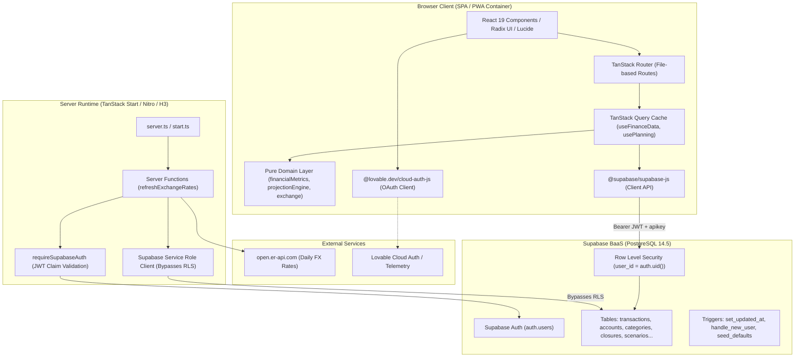
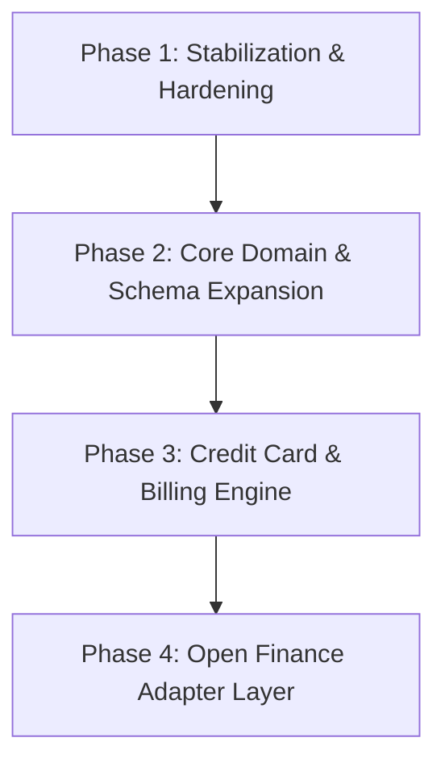

# Baseline Technical Audit — Belchior Pocket

**Document Version:** 1.0.0  
**Audit Date:** 2026-09-29  
**Target Repository:** `belchior-pocket` (Adopted from Lovable codebase)  
**Status:** Audit Completed · Codebase Frozen (Read-Only Audit)

---

## 1. Executive Summary

Belchior Pocket is a Personal Finance Operating System (OS) built to answer three core questions for the user: *Past* ("What happened to my money?"), *Present* ("How is my financial situation now?"), and *Future* ("Where will I end up if I continue like this?").

The current repository was developed using the Lovable low-code generator and exported as a full-stack TypeScript application built with **TanStack Start**, **TanStack Router**, **TanStack Query**, **React 19**, **Tailwind CSS v4**, and **Supabase (PostgreSQL + RLS + GoTrue Auth)**.

### Key Strengths
1. **Deterministic Core:** The financial domain calculation logic (`src/domain/`) is strictly pure, deterministic, and integer-cents-based. No LLM or AI APIs are used for financial arithmetic.
2. **Clean Separation of Domain:** Modules such as `projectionEngine.ts`, `financialMetrics.ts`, `planning.ts`, and `exchange.ts` are decoupled from React and database primitives.
3. **Multi-Currency Foundation:** A sound multi-currency model with historic daily exchange rates and triangulation via a pivot currency is in place.
4. **Unified Income Flow (Migration 7):** Real monthly income was recently consolidated into the `transactions` table (`type = 'INCOME'`), removing the deprecated `income_entries` table and unifying monthly closing derivations.

### Critical Deficits & Blockers
1. **Open Finance Blockers:** The transaction and account models lack external identifiers (`external_id`, `provider`, `connector_id`), sync tokens, account sync statuses, and user override flags. Ingesting Open Finance data without schema redesign will result in data collisions or loss of manual user customizations.
2. **Credit Card & Bill Payment Flaws:** The system has no concept of a `CREDIT_CARD` account type, credit limit, statement closing date, payment due date, or card invoices. Importing bank statement debits for credit card bill payments risks severe double-counting of expenses alongside individual card purchases.
3. **Zero Installment (Parcelamento) Support:** Brazilian installment purchases (e.g., "1/10", "2/10") cannot be grouped, scheduled, or projected.
4. **Collision-Prone Deduplication:** The deduplication hash (`dedupe_hash`) hashes `occurred_on + amount + currency + description` via a 32-bit FNV derivative. Legitimate repeated transactions on the same day (e.g., two coffees of R$ 8.00 at the same store) collide, causing unique constraint violations (`transactions_user_dedupe_key`).
5. **No Mutation Freezing on Closed Months:** Closures (`closures`) store a frozen totals JSON snapshot, but transactions for closed months are not locked in database RLS or application routes.
6. **Lovable Vendor Lock-In & Telemetry:** Google OAuth is routed through `@lovable.dev/cloud-auth-js` instead of native Supabase OAuth; client-side runtime errors are intercepted and forwarded to Lovable telemetry hooks.

---

## 2. Architecture Diagram

The diagram below reflects the current runtime and build architecture:



---

## 3. Current Domain Model

The domain layer is encapsulated under [`src/domain`](file:///c:/Users/gabri/Git/Finance/belchior-pocket/src/domain). It is strictly free of React or UI imports.

```
src/domain/
├── types.ts                   # Core entities and TypeScript contracts
├── currency.ts                # Supported currencies, money helper, parsing
├── exchange.ts                # Deterministic currency conversion & triangulation
├── financialMetrics.ts        # Net worth, expense/income breakdowns, savings rate
├── planning.ts                # Scenarios, IncomePlan, ExpensePlan, anniversary adjustment
├── projectionEngine.ts        # Multi-month deterministic wealth projection
├── categorizationEngine.ts    # Rule matching (CONTAINS, STARTS_WITH, EQUALS, REGEX)
├── csv.ts                     # Tolerant CSV parsing, classification, FNV dedupe hash
└── summaryPhrases.ts          # Deterministic textual highlights for dashboard & closures
```

### Entity Contracts & Relationships

1. **Money & Currencies ([`currency.ts`](file:///c:/Users/gabri/Git/Finance/belchior-pocket/src/domain/currency.ts)):**
   - Values are stored as integer cents (`amountCents: number`, `amount_cents: number`).
   - Standard currencies: `BRL` (default/pivot), `CAD`, `USD`, `EUR`, `ARS`.
   - Conversions use historical exchange rates (`exchange_rates`) effective on or prior to the transaction date.
2. **Transactions ([`types.ts`](file:///c:/Users/gabri/Git/Finance/belchior-pocket/src/domain/types.ts#L52-L70)):**
   - Types: `EXPENSE`, `INCOME`, `TRANSFER`, `INVESTMENT_CONTRIBUTION`.
   - Fields: `id`, `occurred_on`, `description`, `amount_cents`, `currency`, `type`, `category_id`, `account_id`, `closure_id`, `source`, `dedupe_hash`, `notes`, `is_demo`, `income_type`, `income_nature`.
3. **Categories ([`types.ts`](file:///c:/Users/gabri/Git/Finance/belchior-pocket/src/domain/types.ts#L31-L39)):**
   - Hierarchical with `parent_id`.
   - Kinds: `EXPENSE`, `INCOME`, `INVESTMENT`, `TRANSFER`.
   - Flag `essential: boolean` distinguishes essential costs from discretionary spending.
4. **Accounts & Balances ([`types.ts`](file:///c:/Users/gabri/Git/Finance/belchior-pocket/src/domain/types.ts#L72-L91)):**
   - Types: `CHECKING`, `SAVINGS`, `INVESTMENT`, `FIXED_INCOME`, `STOCKS`, `FUNDS`, `PENSION`, `PROPERTY`, `OTHER_ASSET`, `DEBT`.
   - Sides: `ASSET`, `LIABILITY`.
   - Balances: Monthly snapshot table `account_balances(account_id, month, balance_cents)`.
5. **Planning & Projections ([`planning.ts`](file:///c:/Users/gabri/Git/Finance/belchior-pocket/src/domain/planning.ts), [`projectionEngine.ts`](file:///c:/Users/gabri/Git/Finance/belchior-pocket/src/domain/projectionEngine.ts)):**
   - `Scenario`: Horizon (e.g. 60 months), expected monthly return (`expected_monthly_return`, default 0.8% a.m.).
   - `IncomePlan` & `ExpensePlan`: Frequencies (`MONTHLY`, `BIMONTHLY`, `QUARTERLY`, `SEMIANNUAL`, `YEARLY`, `ONCE`), custom months list (`months_of_year`), start/end dates, and annual adjustment percent.
   - Evolution formula:
     $$\text{netWorthEnd} = \text{netWorthStart} + \text{cashFlow} + \text{investmentReturn}$$
     where $\text{cashFlow} = \text{totalIncome} - \text{totalExpenses}$.

---

## 4. Current Database Model

The database schema is managed via 7 migration files in [`supabase/migrations`](file:///c:/Users/gabri/Git/Finance/belchior-pocket/supabase/migrations):

```
supabase/migrations/
├── 20260728133949_911a4e50-6e6f-4e54-a3e8-1c25dbdbb5a2.sql  # Initial schema, tables, seed_defaults
├── 20260728134004_c3a115e2-7b0c-4a88-bdd2-47aeb84c2abd.sql  # Security revocations on seed functions
├── 20260728143425_0a099f0e-81ca-46e0-bbbc-3163b4271ad8.sql  # currency_code ENUM & exchange_rates table
├── 20260728150349_0850bd8b-504e-4174-8196-62d550f769a6.sql  # Cleanup duplicates & explicit UNIQUE constraints
├── 20260728160830_c63eb201-1537-4c1b-9984-9925bf3fbc8f.sql  # Scenarios, income_plans, expense_plans, duplicate_scenario
├── 20260728160904_a4afa55c-50e5-4140-86e2-d7977a47ea9f.sql  # duplicate_scenario permissions
└── 20260731171419_db2b33b7-9818-41a6-8f17-e344fbecacef.sql  # Drop income_entries, merge into transactions
```

### Database Tables Summary

| Table | Primary Key | Key Foreign Keys | Unique Constraints | RLS Enabled |
|---|---|---|---|:---:|
| `profiles` | `id (UUID)` | `id -> auth.users.id` | PK | Yes |
| `settings` | `user_id (UUID)` | `user_id -> auth.users.id` | PK | Yes |
| `categories` | `id (UUID)` | `user_id -> auth.users.id`, `parent_id -> categories.id` | None | Yes |
| `categorization_rules` | `id (UUID)` | `user_id -> auth.users.id`, `category_id -> categories.id` | None | Yes |
| `accounts` | `id (UUID)` | `user_id -> auth.users.id` | None | Yes |
| `account_balances` | `id (UUID)` | `user_id -> auth.users.id`, `account_id -> accounts.id` | `(user_id, account_id, month)` | Yes |
| `closures` | `id (UUID)` | `user_id -> auth.users.id` | `(user_id, month)` | Yes |
| `transactions` | `id (UUID)` | `user_id -> auth.users.id`, `category_id`, `account_id`, `closure_id` | `(user_id, dedupe_hash)` | Yes |
| `exchange_rates` | `id (UUID)` | Shared lookup table | `(base_currency, quote_currency, effective_on)` | Yes (Public Read) |
| `scenarios` | `id (UUID)` | `user_id -> auth.users.id` | None | Yes |
| `income_plans` | `id (UUID)` | `user_id -> auth.users.id`, `scenario_id -> scenarios.id` | None | Yes |
| `expense_plans` | `id (UUID)` | `user_id -> auth.users.id`, `scenario_id -> scenarios.id`, `category_id` | None | Yes |
| `import_profiles` | `id (UUID)` | `user_id -> auth.users.id` | None | Yes |

---

## 5. Correctly Implemented Areas

The following components and business rules are implemented cleanly and adhere to core requirements:

1. **Monthly Result Formula:**  
   Implemented as $\text{Monthly Result} = \text{Total Income} - \text{Total Expenses}$ in [`src/domain/financialMetrics.ts:L250`](file:///c:/Users/gabri/Git/Finance/belchior-pocket/src/domain/financialMetrics.ts#L250).
2. **Exclusion of Transfers & Investment Contributions:**  
   In [`src/domain/financialMetrics.ts:L93`](file:///c:/Users/gabri/Git/Finance/belchior-pocket/src/domain/financialMetrics.ts#L93) and [`L158`](file:///c:/Users/gabri/Git/Finance/belchior-pocket/src/domain/financialMetrics.ts#L158), `TRANSFER` and `INVESTMENT_CONTRIBUTION` are explicitly bypassed during income and expense aggregation.
3. **Deterministic Financial Math:**  
   All calculations use integer cents, pure functions, zero random numbers, and zero AI dependencies.
4. **Income Categorization Model:**  
   Migration 7 successfully migrated manual income entries into `transactions` with `type = 'INCOME'`, `income_type`, and `income_nature`, supporting breakdown by nature (recurring, temporary, extraordinary) and category slices.
5. **Multi-Currency Conversion Architecture:**  
   [`src/domain/exchange.ts`](file:///c:/Users/gabri/Git/Finance/belchior-pocket/src/domain/exchange.ts) provides deterministic currency conversion with historical exchange rate lookup (rate effective on or before transaction date), inverted rate resolution, and pivot triangulation through BRL.
6. **Scenario & Projection Engine:**  
   [`src/domain/projectionEngine.ts`](file:///c:/Users/gabri/Git/Finance/belchior-pocket/src/domain/projectionEngine.ts) accurately handles recurring vs extraordinary income, essential vs discretionary expenses, step frequencies, and anniversary-only annual adjustments.
7. **Basic Row Level Security:**  
   All private user tables enforce strict PostgreSQL RLS policies (`auth.uid() = user_id`).

---

## 6. Incorrect or Risky Areas

### 6.1 Transaction Deduplication Collision (Critical Bug)
- **Code:** [`src/domain/csv.ts:L196-L216`](file:///c:/Users/gabri/Git/Finance/belchior-pocket/src/domain/csv.ts#L196-L216)
- **Issue:** The dedupe hash is computed strictly from `occurredOn|amountCents|currency|normalizedDescription`.  
  A database constraint `UNIQUE(user_id, dedupe_hash)` exists on `transactions`.
- **Consequence:** If a user conducts two identical transactions on the same day (e.g., two coffees for R$ 8.00 at "Padaria Estrela", or two R$ 20.00 metro card recharges), the second transaction is dropped during import or fails with a unique constraint violation when entered manually.

### 6.2 Investment Return Calculation on Illiquid / Non-Invested Assets
- **Code:** [`src/domain/projectionEngine.ts:L99`](file:///c:/Users/gabri/Git/Finance/belchior-pocket/src/domain/projectionEngine.ts#L99)
- **Specification (README L887):** $\text{investmentReturn} = \text{investedBalanceStartOfMonth} \times \text{monthlyRate}$.
- **Actual Code:** `investmentReturn = netWorth > 0 ? Math.round(netWorth * input.expectedMonthlyReturn) : 0`.
- **Consequence:** If a user has a house valued at R$ 800,000 and a car at R$ 100,000, but only R$ 50,000 in stocks, the projection applies the 0.8% monthly return to the entire R$ 950,000 net worth, massively exaggerating future portfolio gains.

### 6.3 Hardcoded 2,000 Transaction Query Limit
- **Code:** [`src/hooks/useFinanceData.ts:L102`](file:///c:/Users/gabri/Git/Finance/belchior-pocket/src/hooks/useFinanceData.ts#L102)
- **Issue:** `query.limit(2000)` is hardcoded without pagination or cursor support. Users with high transaction volumes or long histories will have historical transactions silently truncated.

### 6.4 Client-Side O(N) Sequential Mutation Loop on Rule Reapplication
- **Code:** [`src/routes/configuracoes.tsx:L145-L157`](file:///c:/Users/gabri/Git/Finance/belchior-pocket/src/routes/configuracoes.tsx#L145-L157)
- **Issue:** Reapplying categorization rules runs a client-side JavaScript loop with sequential `await updateTransaction.mutateAsync(...)` calls. For 500 uncategorized transactions, this triggers 500 individual sequential HTTP mutations to Supabase.

### 6.5 Settings UI Rule Creation Hardcodes "EXPENSE"
- **Code:** [`src/routes/configuracoes.tsx:L138`](file:///c:/Users/gabri/Git/Finance/belchior-pocket/src/routes/configuracoes.tsx#L138)
- **Issue:** When adding a rule in the settings dialog, `target_type: "EXPENSE"` is hardcoded. Users cannot define rules to automatically classify transactions as `INCOME`, `TRANSFER`, or `INVESTMENT_CONTRIBUTION`.

### 6.6 Closures Do Not Freeze Transactions
- **Code:** [`src/routes/fechamentos.tsx:L72-L81`](file:///c:/Users/gabri/Git/Finance/belchior-pocket/src/routes/fechamentos.tsx#L72-L81)
- **Issue:** Toggling a month to `CLOSED` stores a snapshot in `closures.totals`, but does not associate `transactions.closure_id` nor enforce any database constraint preventing transactions in closed months from being edited, created, or deleted.

---

## 7. Open Finance Blockers

Integrating an Open Finance aggregator (e.g., Pluggy, Klarna, Belvo, or Open Finance Brasil API) is currently **blocked** by architectural omissions:

1. **No External Entity Mapping:**  
   The `accounts` and `transactions` tables have no columns for `external_id`, `provider` (e.g., 'PLUGGY', 'OPEN_FINANCE'), `item_id`, or `connector_id`.
2. **Incompatible Deduplication Strategy:**  
   Open Finance providers supply immutable transaction IDs (e.g., FITID or UUIDs) and pending/posted status flags. Using Belchior's string-based `dedupe_hash` will fail when transactions transition from pending to posted or when bank descriptions update slightly upon settlement.
3. **No User Override Isolation (Sync Survivability):**  
   If an Open Finance sync updates a transaction's description or category, there is no `is_user_overridden`, `user_category_id`, or `original_payload` field to prevent external syncs from overwriting user customizations.
4. **Lack of Account Sync Metadata:**  
   Open Finance returns live account balances, credit card limits, and sync timestamps. Currently, accounts only support manual monthly balances in `account_balances`.
5. **No Normalization / Ingestion Pipeline:**  
   No adapter layer exists between external financial data payloads and the Belchior domain schema.

---

## 8. Credit-Card Blockers

Credit-card handling is currently **not functional for real-world card mechanics**:

1. **Missing Account Type:**  
   The `accounts.type` database enum/check constraint (`CHECKING`, `SAVINGS`, `INVESTMENT`, etc.) does not contain `CREDIT_CARD`.
2. **Missing Card Terms & Billing Cycles:**  
   Credit cards require attributes for:
   - Total Credit Limit (`limit_cents`)
   - Statement Closing Day (`closing_day`, dia de fechamento)
   - Payment Due Day (`due_day`, dia de vencimento)
3. **Absence of Card Invoices (Faturas):**  
   Purchases on credit cards do not belong to the calendar month of the purchase; they belong to a card billing invoice. A purchase on May 28 with statement closing on May 25 belongs to the June invoice, due in July. The current model only tracks `occurred_on` (calendar date).
4. **Double-Counting Risk on Bill Payment:**  
   When a user pays their credit card bill, the debit appears on their checking account statement (e.g., "PAGTO FATURA CARTAO - R$ 4.250,00"). If imported as an expense, the expenses are double-counted because the individual purchases were already imported from the card invoice. The system lacks any mechanism to link a checking account bill payment to a card invoice transfer.
5. **Zero Installment (Parcelamento) Support:**  
   There are no fields for `installment_number`, `installment_total`, or `installment_group_id`. Future installments cannot be scheduled or projected in the cashflow budget.

---

## 9. Business-Rule Violations & Inconsistencies

| Business Rule | Implementation Status | Finding / Violation Detail |
|---|:---:|---|
| **Monthly result = income - expenses** | **COMPLIANT** | Derived directly in `financialMetrics.ts:L250` as `income.total - expenses.total`. |
| **Transfers are not income or expenses** | **COMPLIANT** | Ignored by both `expenseBreakdown` and `incomeBreakdown`. |
| **Investment contributions are allocations, not expenses** | **COMPLIANT** | Ignored by `expenseBreakdown`, isolated in `investmentTotal`. |
| **Credit-card purchases are expenses on purchase date** | **PARTIALLY COMPLIANT** | Imported with `occurred_on = purchase_date`, but lacks billing cycle / invoice tracking. |
| **Installments must be represented individually** | **NON-COMPLIANT** | **VIOLATION:** Schema has no installment index, total, or parent group concept. |
| **Card bill payment must not create an expense** | **AT RISK** | **VIOLATION:** No automatic detection or transfer reconciliation for card bill debits; easily double-counted as an expense. |
| **Cash withdrawal is an expense** | **PARTIALLY COMPLIANT** | Treated as expense if mapped to `EXPENSE`, but no explicit ATM / cash classification. |
| **Bank fees and interest are expenses** | **COMPLIANT** | Handled as standard `EXPENSE` entries. |
| **Income categories are customizable** | **COMPLIANT** | Fully supported in `categories` where `kind = 'INCOME'`. |
| **Expense categories are customizable** | **COMPLIANT** | Fully supported in `categories` where `kind = 'EXPENSE'`. |
| **User edits must survive Open Finance sync** | **NON-COMPLIANT** | **VIOLATION:** No override tracking (`user_modified`, original fields) exists in the schema. |
| **Open Finance data normalized to domain** | **NON-COMPLIANT** | **VIOLATION:** No ingestion, normalization, or provider adapter layer exists. |
| **Provider concepts must not leak into domain** | **COMPLIANT** | Domain types in `src/domain/types.ts` remain clean of vendor tokens. |
| **Financial calculations must be deterministic** | **COMPLIANT** | Pure functions across `src/domain/`, zero floating-point cents bugs. |
| **AI never required for calculations** | **COMPLIANT** | Calculations are 100% deterministic code. |
| **Raw financial data never sent to AI without need** | **COMPLIANT** | No AI SDKs or endpoints integrated. |

---

## 10. Security Concerns

1. **Third-Party OAuth Proxy Dependency (`@lovable.dev/cloud-auth-js`):**  
   - In [`src/integrations/lovable/index.ts:L5`](file:///c:/Users/gabri/Git/Finance/belchior-pocket/src/integrations/lovable/index.ts#L5) and [`src/routes/auth.tsx:L72`](file:///c:/Users/gabri/Git/Finance/belchior-pocket/src/routes/auth.tsx#L72), Google OAuth triggers `lovable.auth.signInWithOAuth`.
   - OAuth flows are brokered through an external Lovable Cloud proxy. If disconnected from Lovable, social authentication fails.
2. **Client-Side Runtime Telemetry Hook:**  
   - In [`src/lib/lovable-error-reporting.ts`](file:///c:/Users/gabri/Git/Finance/belchior-pocket/src/lib/lovable-error-reporting.ts) and [`src/routes/__root.tsx:L44`](file:///c:/Users/gabri/Git/Finance/belchior-pocket/src/routes/__root.tsx#L44), errors and route paths are forwarded to `window.__lovableEvents` and `window.__lovableReportRuntimeError`.
3. **Admin Service Role Access in Server Functions:**  
   - [`src/lib/exchangeRates.functions.ts:L15`](file:///c:/Users/gabri/Git/Finance/belchior-pocket/src/lib/exchangeRates.functions.ts#L15) imports `supabaseAdmin` using `process.env.SUPABASE_SERVICE_ROLE_KEY` to update daily exchange rates. Although protected with `requireSupabaseAuth`, granting service role operations from web handlers must be strictly monitored.
4. **Missing Closed-Month Mutation Guard:**  
   - RLS policies only check `auth.uid() = user_id`. There is no check verifying if the transaction date falls within a closed month (`closures.status = 'CLOSED'`), allowing silent alteration of historical financial records.

---

## 11. Testing Gaps

There are currently **3 test files** with **27 passing unit tests**:
- [`src/domain/__tests__/exchange.test.ts`](file:///c:/Users/gabri/Git/Finance/belchior-pocket/src/domain/__tests__/exchange.test.ts) (10 tests)
- [`src/domain/__tests__/incomeFromTransactions.test.ts`](file:///c:/Users/gabri/Git/Finance/belchior-pocket/src/domain/__tests__/incomeFromTransactions.test.ts) (5 tests)
- [`src/domain/__tests__/projection.test.ts`](file:///c:/Users/gabri/Git/Finance/belchior-pocket/src/domain/__tests__/projection.test.ts) (12 tests)

### Critical Untested Components
1. **Categorization Engine (`categorizationEngine.ts`):** 0 tests for `normalize`, pattern matching (`CONTAINS`, `STARTS_WITH`, `EQUALS`, `REGEX`), and priority ordering.
2. **CSV Parsing & Validation (`csv.ts`):** No tests for delimiter detection, quoting rules, date parsing (`parseDate`), amount-to-cents parsing (`parseAmountToCents`), row mapping, or `dedupeHash`.
3. **Expense Breakdown & Net Worth (`financialMetrics.ts`):** No tests for `expenseBreakdown`, `netWorthForMonth`, `netWorthSeries`, `savingsRate`, `reserveMonths`, or `emergencyFundTarget`.
4. **Dashboard Highlights & Phrases (`summaryPhrases.ts`):** 0 tests for contextual phrase generation.
5. **Database RLS Policies & Triggers:** No automated integration tests validating that user data cannot leak between tenants or that triggers fire as expected.
6. **Package Scripts:** `package.json` lacks a `"test": "vitest run"` script.

---

## 12. Recommended Remediation Order

To transition from the Lovable prototype baseline to the production Belchior Pocket architecture, remediation should follow this strict sequence:



### Phase 1: Stabilization & Hardening (No Architectural Disruption)
1. Add `"test": "vitest run"` and `"test:watch": "vitest"` to `package.json`.
2. Expand test coverage across `csv.ts`, `categorizationEngine.ts`, and `financialMetrics.ts`.
3. Replace the faulty 32-bit FNV deduplication hash with a composite sequence counter or natural key (or permit same-day duplicate amounts with sequence salts).
4. Remove Lovable telemetry error-reporting hooks and decouple Google OAuth from `@lovable.dev/cloud-auth-js` in favor of direct Supabase OAuth.
5. Add DB triggers or check constraints preventing transaction mutation in closed months.

### Phase 2: Core Domain & Schema Expansion
1. Fix projection return formula in `projectionEngine.ts` so investment return applies only to liquid/invested asset accounts, not illiquid property/debt.
2. Add target type selection to rule creation in `configuracoes.tsx`.
3. Add double-entry or paired transfer tracking (`destination_account_id` or `transfer_pair_id`) to `transactions`.
4. Replace client-side sequential mutation loop in `reapplyRules` with a bulk Supabase RPC function.

### Phase 3: Credit Card & Billing Engine
1. Add `CREDIT_CARD` account type to `accounts`.
2. Create `credit_card_invoices` (faturas) table with `closing_date`, `due_date`, and `status`.
3. Add installment metadata (`installment_number`, `installment_total`, `installment_group_id`) to `transactions`.
4. Implement automatic reconciliation for credit card bill payment debits to prevent double-counting.

### Phase 4: Open Finance Adapter Layer
1. Add external synchronization metadata columns (`external_id`, `provider`, `connector_id`, `last_synced_at`, `sync_status`).
2. Add manual override tracking flags (`is_user_modified`, `original_description`, `original_category_id`).
3. Build the normalization pipeline isolating external provider schemas from the Belchior domain.

---

## 13. Things That Should NOT Be Changed Yet

1. **Integer Cents Representation (`amount_cents: number`):** Do not change financial values to floats or introduce BigInt formatting libraries. Integer cents are clean, performant, and reliable.
2. **Deterministic Domain Isolation:** Keep `src/domain/` completely decoupled from React hooks, TanStack Query, and Supabase client code.
3. **Multi-Currency Architecture (`currency.ts` & `exchange.ts`):** The triangulation logic, historical exchange rate resolution, and currency interfaces are well-designed and should be preserved.
4. **Consolidated Transactions Model (Migration 7):** Do not re-introduce a separate `income_entries` table. Deriving income from `transactions` where `type = 'INCOME'` is the right architectural decision.
5. **No AI in Calculations:** Continue prohibiting LLM / AI integration for financial metrics and projection calculations.

---

## V1 Open Finance Readiness

Evaluation of Belchior Pocket's readiness for Open Finance integration across individual capabilities:

| Functional Area | Status | Key Rationale |
|---|:---:|---|
| **Deterministic Financial Calculations** | **READY** | Integer cents, pure math functions, zero AI dependencies. |
| **Multi-Currency System** | **READY** | Historical rate lookup, triangulation via BRL pivot, fallback safety. |
| **Income Derivation from Transactions** | **READY** | Consolidated under `transactions`, categorized by nature and type. |
| **Category Customization** | **READY** | Full support for user-defined expense and income category hierarchies. |
| **Responsive Web Layout** | **READY** | Clean responsive layout with desktop sidebar and mobile navigation. |
| **Deduplication & Idempotency** | **PARTIALLY READY** | Concept exists, but FNV 32-bit hash causes false positive collisions on same-day purchases. |
| **Planning & Wealth Projections** | **PARTIALLY READY** | Engine works, but erroneously compounds returns over illiquid assets. |
| **Monthly Closures (Fechamentos)** | **PARTIALLY READY** | Calculates totals correctly, but fails to lock closed transactions against edits. |
| **Mobile / PWA Capabilities** | **PARTIALLY READY** | Mobile responsive, but no PWA manifest, service worker, or offline cache. |
| **Credit Card Account Modeling** | **NOT READY** | No `CREDIT_CARD` account type, no credit limit, closing date, or due date. |
| **Credit Card Invoice (Fatura) Handling** | **NOT READY** | Lacks invoice entity; card purchases cannot be assigned to billing cycles. |
| **Bill Payment Reconciliation** | **NOT READY** | No mechanism to prevent card bill payment debits from double-counting expenses. |
| **Installment (Parcelamento) Support** | **NOT READY** | No installment index, total, or recurrence group scheduling. |
| **User Override Preservation** | **NOT READY** | No flags or columns to prevent external syncs from overwriting user edits. |
| **Open Finance Entity Mapping & Adapter** | **NOT READY** | No `external_id`, provider metadata, or normalization pipeline. |
| **Independent Authentication** | **PARTIALLY READY** | Standard Supabase email/password works, but Google OAuth is tied to Lovable Cloud. |
